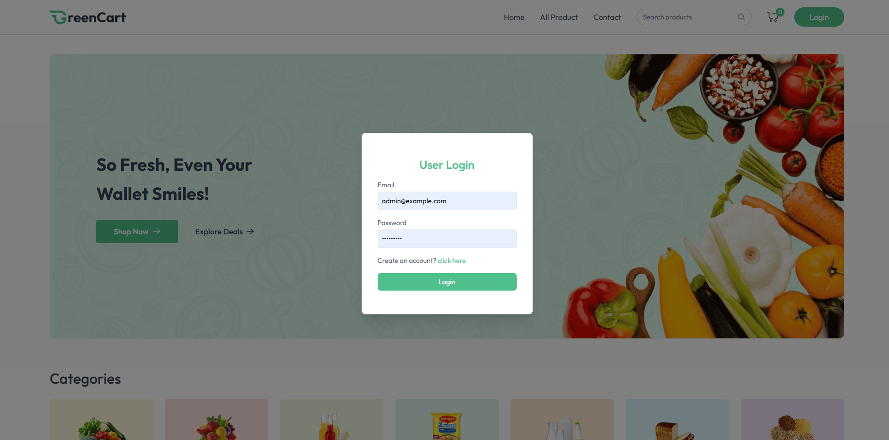
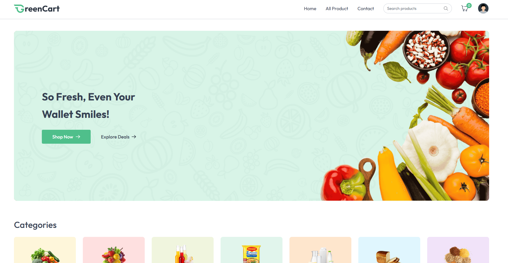
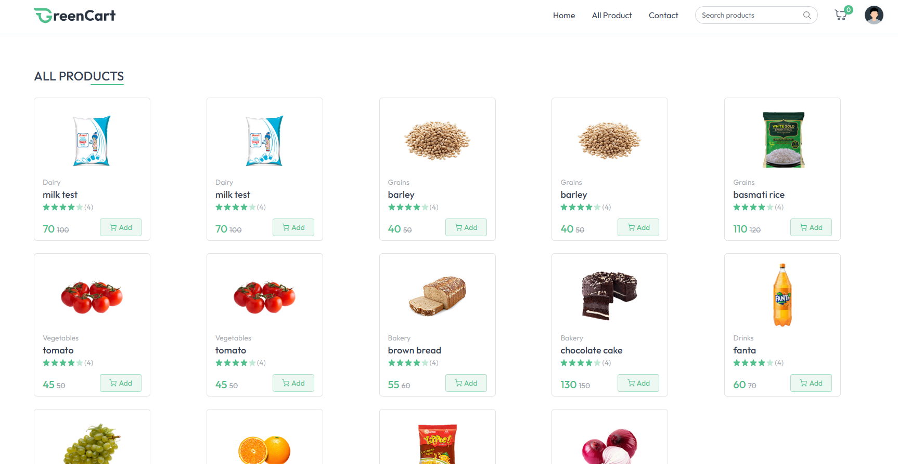
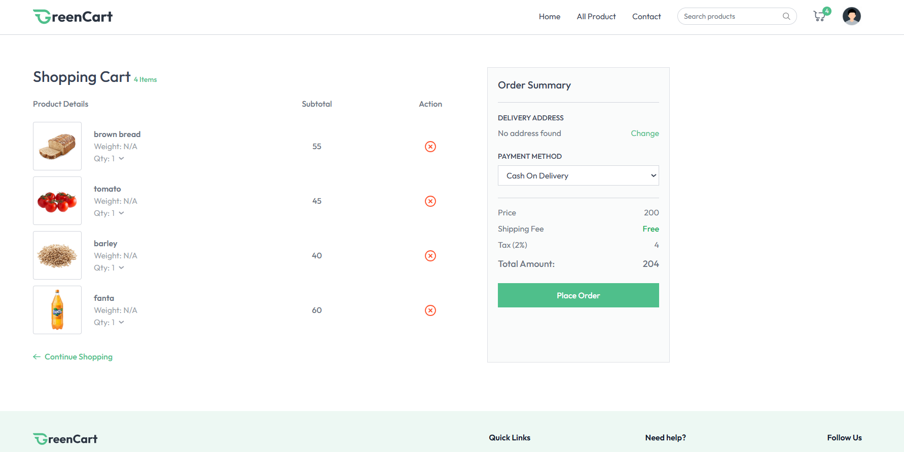
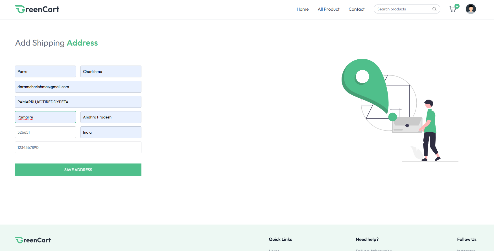
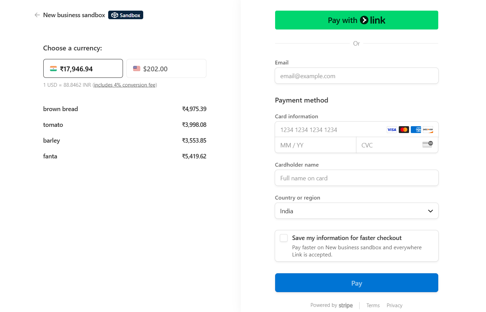
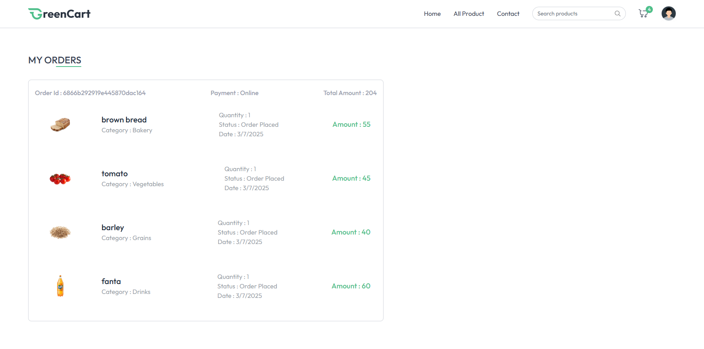
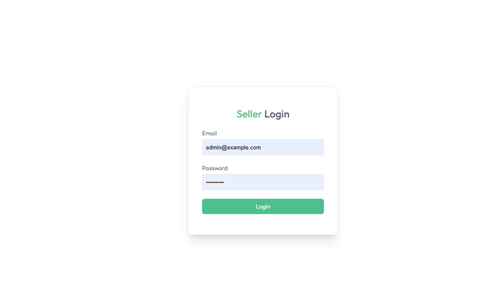
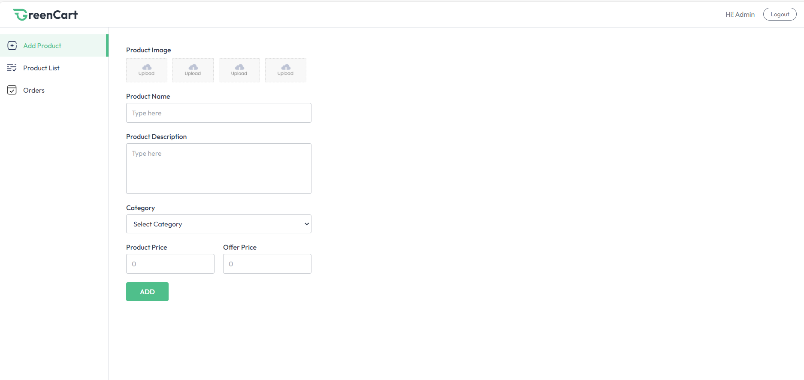
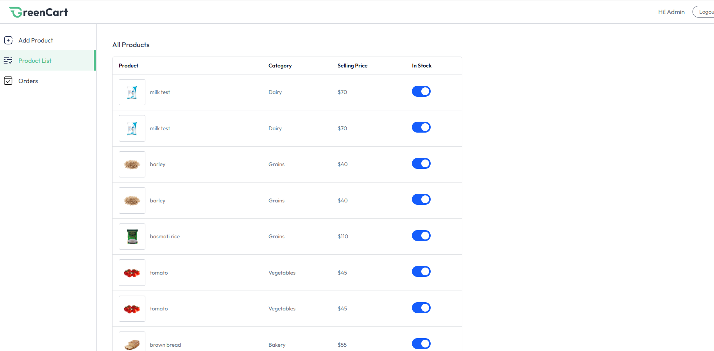

# 🛒 GreenCart – Fresh Groceries Delivered Smartly

**GreenCart** is a modern full-stack e-commerce platform designed to bring **fresh groceries** and **daily essentials** directly to your doorstep. With intuitive browsing, seamless shopping, and powerful seller tools, GreenCart empowers both consumers and local sellers to thrive in a digital-first grocery ecosystem.

---

## 🌟 Features at a Glance

✅ Secure User Authentication  
✅ Browse & Search Grocery Products  
✅ Smart Cart & Checkout  
✅ Track Orders in Real-Time  
✅ Seller Dashboard to Manage Listings  
✅ Image Uploads via Cloudinary  
✅ Payments with Stripe Integration  
✅ Responsive & Intuitive UI (React + Vite)

---

## 🛠️ Tech Stack

| Category         | Tech Used                             |
|------------------|----------------------------------------|
| **Frontend**     | React, Vite, Tailwind CSS / CSS        |
| **Backend**      | Node.js, Express.js                    |
| **Database**     | MongoDB (Mongoose)                     |
| **Authentication** | JWT, bcrypt                         |
| **Image Uploads**| Cloudinary                            |
| **Payments**     | Stripe                                 |
| **Environment**  | dotenv                                 |

---

## 📁 Project Structure

greencart/
├── client/     # React frontend
└── server/     # Node.js + Express backend

---

## ⚙️ Getting Started

### 🔍 Prerequisites

- Node.js & npm
- MongoDB Atlas or local MongoDB
- Cloudinary Account
- Stripe Developer Account

---

### 🔐 Environment Variables

Create a .env file inside the /server directory with:

env
MONGODB_URI=your_mongodb_connection_string
JWT_SECRET=your_jwt_secret
CLOUDINARY_CLOUD_NAME=your_cloud_name
CLOUDINARY_API_KEY=your_cloudinary_key
CLOUDINARY_API_SECRET=your_cloudinary_secret
STRIPE_SECRET_KEY=your_stripe_key

---

### 📦 Install Dependencies

#### Backend Setup

bash
cd server
npm install

#### Frontend Setup

bash
cd client
npm install

---

### 🚀 Run Locally

#### Start Backend Server

bash
cd server
npm start

> Runs at: http://localhost:4000

#### Start Frontend

bash
cd client
npm run dev

> Runs at: http://localhost:5173

---

## 🔄 API Endpoints Overview

| Route Prefix       | Description                                |
|--------------------|--------------------------------------------|
| /api/user        | Register, login, logout, auth status       |
| /api/product     | Browse, view, and manage products          |
| /api/cart        | Add/remove items from shopping cart        |
| /api/order       | Place orders, view order history           |
| /api/seller      | Seller login, dashboard, product control   |
| /api/address     | User address management                    |

---

## 🔒 Authentication & Security

- 🧠 JWT-based auth stored in HTTP-only cookies
- 🔑 Passwords securely hashed using bcrypt
- 🔐 Protected routes use auth middleware
- 🧭 CORS and secure cookie configuration for production

---

## 🌐 Deployment Notes

- Configure environment variables in your cloud platform
- Set secure HTTPS and HTTP-only cookies
- Use services like Render, Vercel, or Netlify + Railway/Atlas for full deployment
- Configure CORS to allow frontend-backend communication

---

## 📸 Full Website Preview (Screenshots)

## 🖼️ Application Screenshots

### 🔐 Login Page

### 🏠 Home Page

### 🔻 Footer Section

### 🛍️ All Products Listing
 

### 🛒 Cart View

### 🧾 Address Entry Page

### 💳 Payment Integration

### 📦 User Order History

### 🧑‍💼 Admin Login Dashboard

### ➕ Add Product Interface

### 🗂️ Product List View (Seller)
 

### 📑 Seller Order Management

---

## By
Charishma